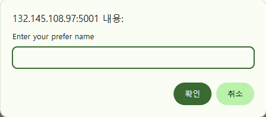
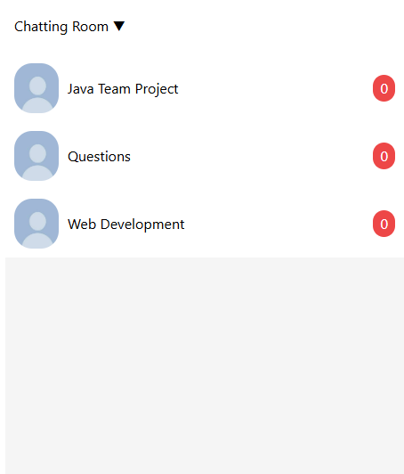
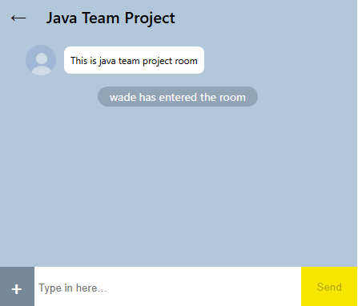
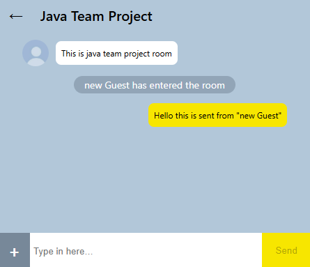
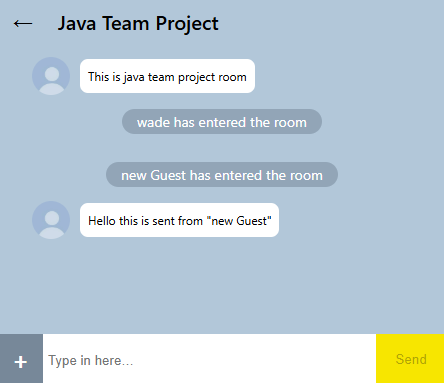
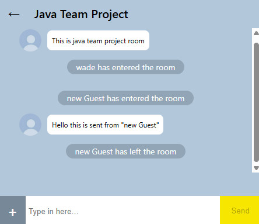

# 💬 Real-time Chat Application

## 🧩 Overview
This is a real-time chat application built with **React**, **Node.js**, and **Socket.IO**.  
Users can join chat rooms, send and receive messages instantly, and see other participants' messages in real time.

---

## 🌐 Live Demo
👉 **[wadechat.wadeverse.net](https://wadechat.wadeverse.net)**  

> 🖥️ Hosted on **Raspberry Pi 5 (Ubuntu 24.04)** with **PM2** and **Cloudflare Tunnel** for secure public access.

---

## 🚀 Features
- 🧑 User login via simple nickname prompt  
- 🗂 Chat room list display (fetched dynamically from the server)  
- 🏠 Join specific chat rooms via unique URL (`/room/:id`)  
- 💬 Real-time messaging powered by **Socket.IO**  
- 👥 Distinguish between system messages, own messages, and others' messages  
- 🖼️ Simple and clean UI built with **MUI** and custom CSS  

---

## 🛠️ Tech Stack

| Layer | Technologies |
|--------|---------------|
| **Frontend** | React, React Router, MUI |
| **Realtime Communication** | Socket.IO |
| **Backend** | Node.js, Express |
| **State Management** | React Hooks (`useState`, `useEffect`) |
| **Styling** | CSS, MUI Base |

---

## ⚙️ Project Structure
```text
chatapp-project/
├── chatapp-client/             # Frontend (React)
│   ├── public/                 # Static files (favicon, index.html)
│   └── src/                    # Source code
│       ├── components/         # Reusable components
│       │   ├── InputField/     # InputField.jsx + InputField.css
│       │   └── MessageContainer/
│       ├── pages/              # Route pages
│       │   ├── RoomListPage/
│       │   └── ChatPage/
│       ├── App.js              # Main app component
│       └── index.js            # ReactDOM entry point
├── server/                     # Backend (Node.js + Socket.IO)
│   ├── Controllers/            # Chat business logic
│   ├── Models/                 # Data structures or DB logic
│   ├── server.js               # Socket.IO server setup
│   └── user.controller.js      # User-related socket logic
├── package.json                # Project metadata and scripts
└── README.md                   # Project documentation
```

## 🧠 App Flow
1. On load, user is prompted to enter a nickname (`prompt()`).
2. The client emits a `login` event to register the user.
3. The app fetches a list of available chat rooms.
4. Clicking a room navigates to `/room/:id`.
5. When joining a room:
   - Client emits a `joinRoom` event.  
   - Server acknowledges and sends a **system message** to the room.  
   - Messages are sent via `sendMessage` and broadcast to all connected clients.

---

## ⚠️ Known Limitations / To-Do
- 🔐 No real authentication (nickname only)  
- 🌸 No persistent storage (messages are in-memory)  
- ➕ Add **room creation** feature (currently static)  
- 🖼️ Improve UI with **TailwindCSS** or full **MUI design system**  
- 💾 Optional: Connect to **MongoDB** for persistent chat history  

---

## 📝 License
MIT License  
Feel free to **use, modify, and contribute!**

---

## 🙌 Acknowledgements
Built with ❤️ using **React**, **Socket.IO**, and **Node.js**.

---

## 🖼 Screenshots

### 1. 🔐 Login Screen  
User is prompted to enter a nickname upon launching the app.



---

### 2. 📋 Chat Room List  
Users can see and select available chat rooms.



---

### 3. 🏠 Chat Room Entry  
On entering a room, the chat interface appears.



---

### 4. 🧑 New User Joined  
A system message is displayed when a new user joins the room.


---

### 5. 🟡 Your Messages (Yellow)  
Messages sent by the current user appear in yellow.



---

### 6. ⚪ Other User Messages (Grey)  
Messages sent by others appear in a white/grey bubble.



---

### 7. 🚪 User Left Notification  
A system message is shown when someone leaves the room.




